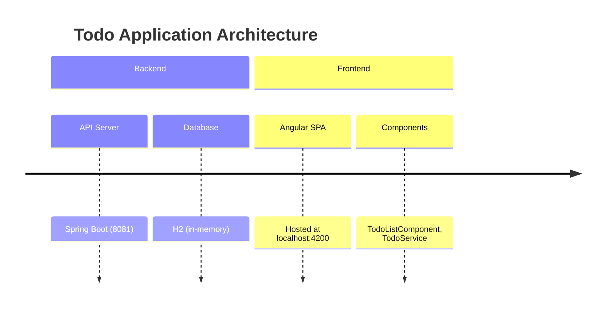

# Todo Application

This repository showcases a simple Todo service consisting of a Spring Boot backend and an Angular frontend.

## Project Overview
- **Backend** – `todo-service`: A Java Spring Boot REST API that persists todo items in an H2 database.
- **Frontend** – `todo-list`: An Angular single‑page application that consumes the API and provides a user interface.

## Features

- **Finance Module**: Manage user accounts and transactions via `/accounts` and `/transactions` APIs, and view them through the new `/finance` UI.

- **Dashboard**: Lazy‑loaded Angular module providing dashboards for accounts and transactions.
- **Top Navigation Bar**: Global navigation with Home and Accounts links.
- **CRUD**: Create, retrieve, update, and delete Todo items via a REST API.
- **In‑memory persistence**: Uses H2 for fast local data storage.
- **CORS**: The backend allows requests from `http://localhost:4200` (Angular dev server).
- **Angular CLI**: Generates component, service, and routing files.

## Prerequisites
- Java 17 (or 21 for the repo’s default Tomcat settings)
- Maven 3.9.x
- Node.js 18+ & npm 9+ (for the Angular app)

## Building & Running
```bash
# Backend
cd todo-service
mvn clean install
java -jar target/todo-service-0.0.1-SNAPSHOT.jar   # runs on http://localhost:8081
```
```bash
# Frontend
cd todo-list
npm install
npm start   # runs on http://localhost:4200
```

## API Reference
All endpoints are documented in **docs/api.md**.

## Architecture Diagram


## Contributing
Feel free to open issues or pull requests. Follow the existing Java and TypeScript style guidelines.

---

*Generated by Claude Code*